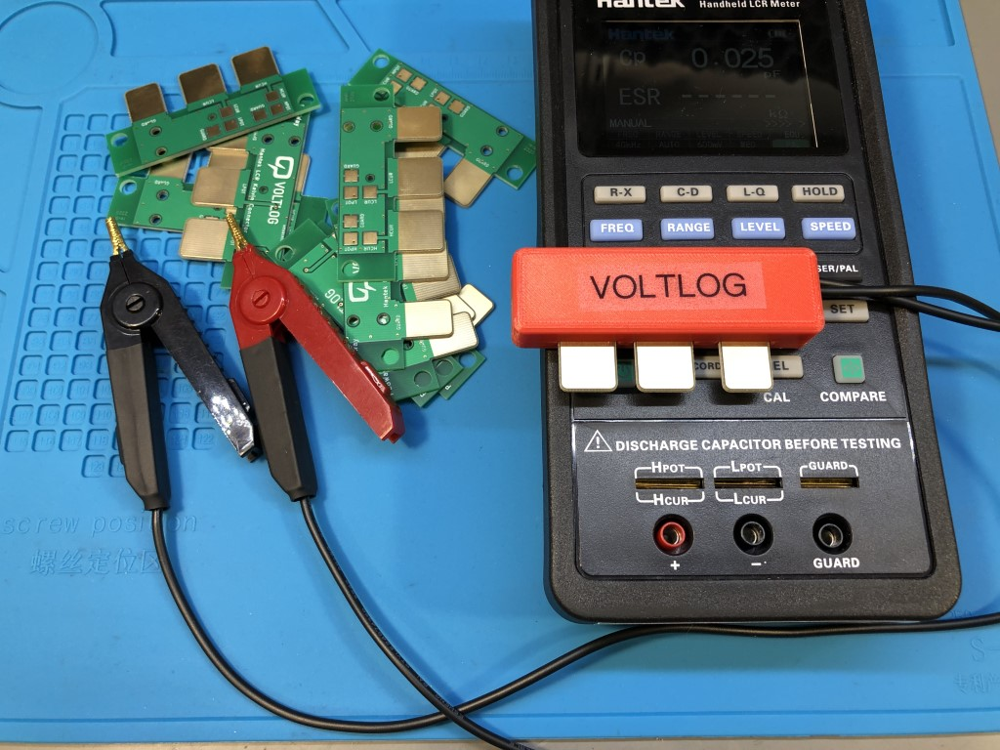

# kelvin-leads
By default the Hantek TO11 (1832C) LCR meter only comes with a pair of short standard aligator clips. In order to perform more accurate measurements I built this 4 wire Kelvin connection test lead set with the proper clips where the top and bottom jaw are not electrically connected. The repository includes the source files for making the PCB that is used as the connection with the LCR meter as well as step files for 3d printing the enclosure of the connector.

Here is a list of supplies that you will need to complete the project:
* Kelvin 4Wire Alligator Clips
  * Aliexpress http://voltlog.com/y/pjwy5
  * Ebay http://voltlog.com/y/kvx4w
* 28AWG Shielded 2 Wire Cable
  * Aliexpress http://voltlog.com/y/ktmr1
  * Ebay http://voltlog.com/y/s3x4w
* PCB Connector Kicad/Gerber (in this repository)
* Connector casing (step files in this repository)

Alternatively you can order the PCB + enclosure from my [Tindie store](https://www.tindie.com/products/voltlog/lcr-meter-kelvin-test-lead-adapter-pcb/).

More info about this project in [Voltlog #326](https://youtu.be/MpJgCks37lE).

